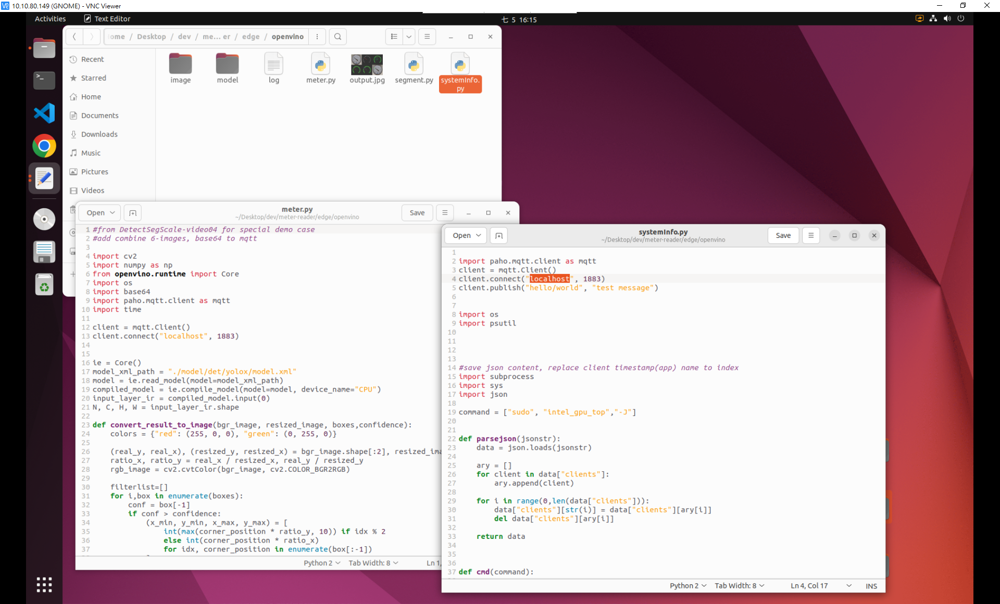

# Smart-Meter-Reader

install guide include below session  
you can prepare couple machines or install server and edge in a machine
- Server   
1. node-red  
2. influxdb  
3. grafana  
- Edge   
4. openvino (example: smart meter reader)   

    
## Server Installation(Host)
- pre-requirement
    
unzip large files    
```shell
sudo chmod +x ./extract.sh    
./extract.sh
```     
    
    
nodejs   
link: https://tecadmin.net/install-latest-nodejs-npm-on-ubuntu/
   
```shell
sudo apt install -y curl 
curl -sL https://deb.nodesource.com/setup_18.x | sudo -E bash - 
sudo apt install -y nodejs 
```  


 
   

validate install  
```shell
node -v
#v18.16.1

npm -v 
#9.5.1
```   
    
   
- node-red installation  
link: https://nodered.org/docs/getting-started/local
   
move to the node-red folder   
```shell
cd dev/meter-reader/server/nodered/
sudo npm install -g --unsafe-perm node-red
node-red
```


   
You can then access the Node-RED editor by pointing your browser at http://localhost:1880.    
*we need to install some node in next config session.       

    
- influxdb installation   
link: https://linux.how2shout.com/how-to-install-influxdb-on-ubuntu-22-04-to-create-database/   
   
```shell
cd dev/meter-reader/server/influxdb
sudo apt update
wget -q https://repos.influxdata.com/influxdata-archive_compat.key
echo '393e8779c89ac8d958f81f942f9ad7fb82a25e133faddaf92e15b16e6ac9ce4c influxdata-archive_compat.key' | sha256sum -c && cat influxdata-archive_compat.key | gpg --dearmor | sudo tee /etc/apt/trusted.gpg.d/influxdata-archive_compat.gpg > /dev/null
echo 'deb [signed-by=/etc/apt/trusted.gpg.d/influxdata-archive_compat.gpg] https://repos.influxdata.com/debian stable main' | sudo tee /etc/apt/sources.list.d/influxdata.list
sudo apt update
sudo apt install influxdb2
sudo systemctl start influxdb
sudo systemctl enable influxdb
sudo systemctl status influxdb
```


   
Open the browser and type: http://localhost:8086

   
- grafana installation   
link: https://grafana.com/docs/grafana/latest/setup-grafana/installation/   
link: https://grafana.com/docs/grafana/latest/setup-grafana/start-restart-grafana/   
   
```shell
cd dev/meter-reader/server/grafana
sudo apt-get install -y apt-transport-https
sudo apt-get install -y software-properties-common wget
sudo wget -q -O /usr/share/keyrings/grafana.key https://apt.grafana.com/gpg.key
echo "deb [signed-by=/usr/share/keyrings/grafana.key] https://apt.grafana.com stable main" | sudo tee -a /etc/apt/sources.list.d/grafana.list
echo "deb [signed-by=/usr/share/keyrings/grafana.key] https://apt.grafana.com beta main" | sudo tee -a /etc/apt/sources.list.d/grafana.list
sudo apt-get update
# Installs the latest OSS release:
sudo apt-get install grafana

```   


   
Open your web browser and go to http://localhost:3000/

    

## Server Installation(Docker)   
- pre-requirement   
install docker and docker-compose  
you should be auto install it in EIV step  
if not, you can flow below link to install it.   
link: https://docs.docker.com/engine/install/ubuntu/ 
    
- docker build   
go to meter/server/docker folder, and run below command   
```shell
docker compose up -d
```

   
- openvino(edge)      
edge meter sample files in ***/data***     
connect container   
```shell
docker exec -it iEi.openvino /bin/bash
cd /data
```


   
- config same as next session, only need to change below network setting(localhost->docker-ip)    
host: 10.0.10.1  
iEi.influxdb: 10.0.10.2  
iEi.grafana: 10.0.10.3   
iEi.nodered: 10.0.10.4  
iEi.openvino: 10.0.10.5      


# Server Config   
- influxdb:   
   
Let's setup influxdb first. because influxdb token is require in other setup.  
    
setup account/password.   


   
copy and save this token. we will use it in other step   

   
   
choose get started and then choose buckets   


   
create buckets and name "**meter**"  
   

   
- node-red(pre-load flows.json)  
if you install and start host version in meter-reader/server/nodered ,it was pre-load flows.json   
we don't need to import flows.json again     

   
base on warning message, we need to install missing node.   

   
menu -> manage palette   

   
search missing node and install it   


   
missing node full name   

    
next step we will setup node-red influxdb node  
please double click one of influxdb node  
 
   
edit server   

   
copy and paste token, and update it, and done.   


   
Deploy    


    
- grafana   

setup username and password   


    
setup data source   

   
choose influxdb

   
quenry language choose Flux(1.8+)   


type influxdb information as pre-step    
*HTTP(URL), Auth(Basic auth), Basic Auth Details(User/Password), InfluxDB Details(Organization/Token)   

   
if influxdb is connecting, it will show "datasource is working. 4 buckets found" on buttom   
   
   
import dashboard  


   
select influxdb data source and import     
  
   
base on warning message, we need to install html-plugin   
link: https://gapit-htmlgraphics-panel.gapit.io/docs/installation/   
   
```shell
sudo mkdir /var/lib/grafana/plugins
sudo grafana-cli plugins install gapit-htmlgraphics-panel
sudo systemctl restart grafana-server
```   
   
   
refresh browser   

   
# Edge Installation 
   
install openvino toolkit   
```shell
sudo apt install python3-dev python3-pip
pip3 install --upgrade pip
pip3 install openvino-dev[tensorflow2,onnx]
```


   
install other lib   
```shell
sudo apt install intel-gpu-tools 
pip3 install paho-mqtt  
pip3 install psutil
```


    
run edge services
```shell
cd dev/meter-reader/edge/openvino
python3 ./systeminfo.py

#open another terminal
python3 ./meter.py
```

   
if edge and server not in the same machine, you only need to edit ip address   

    
open browser and refresh grafana  
home->Dashboards->Demo   

 
   
finish   


   
